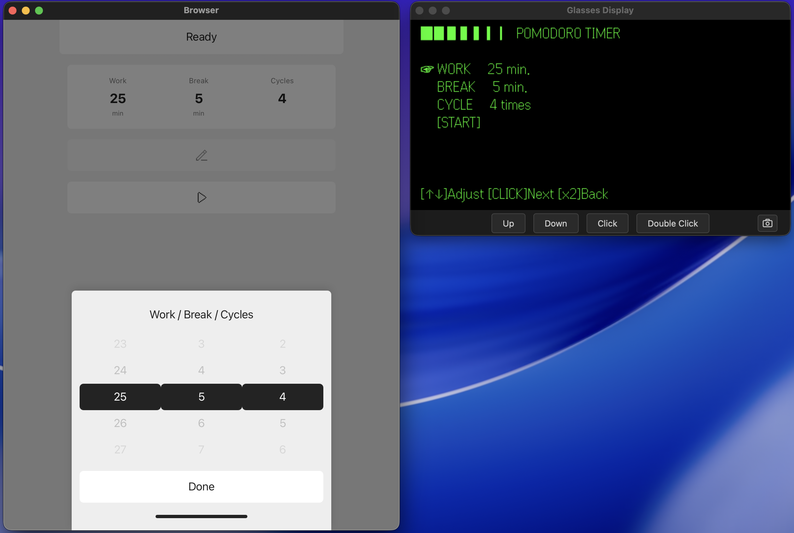
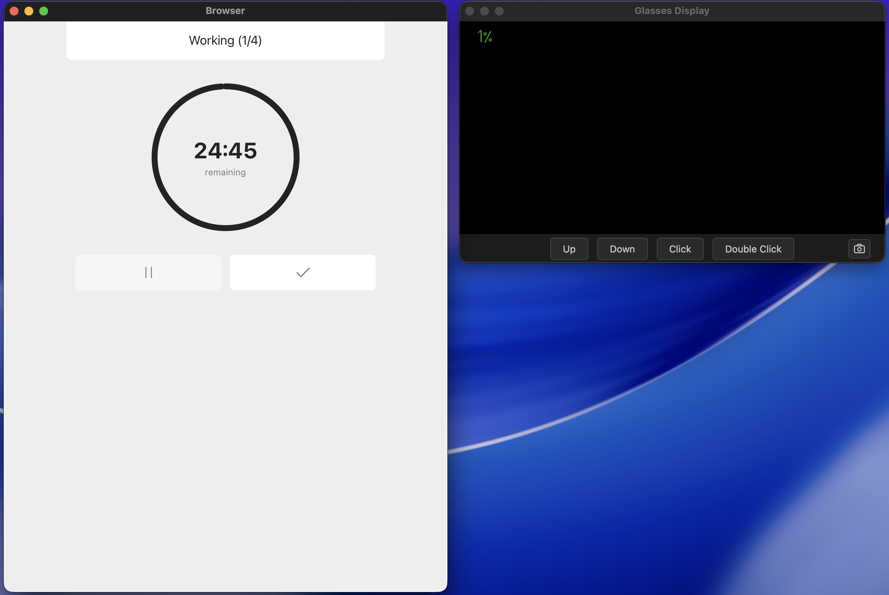
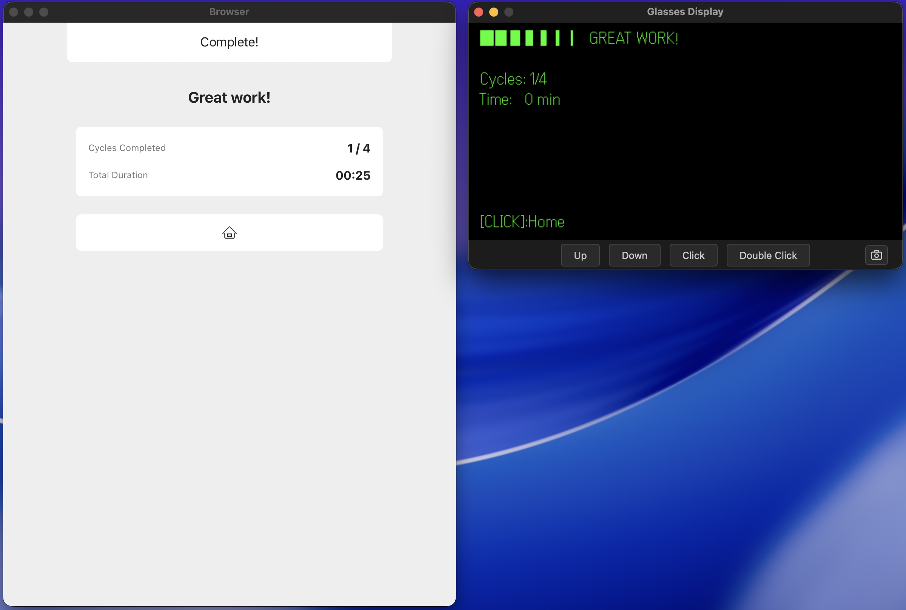

# Even Pomodoro

A Even Pomodoro timer for **Even Realities G2 glasses**. Hands-free focus sessions with configurable work/break durations and session tracking.

---

## Features

### Start Config
- Configure work duration (1-60 minutes)
- Configure break duration (1-30 minutes)
- Configure number of cycles (1-10)
- Visual indicators of total session time
- Start session with one tap

### Session (Work + Break)
- Live countdown timer for both work and break phases
- Current cycle and phase indicator (e.g., "Working (Cycle 2/4)")
- Pause/resume controls
- Complete session early button
- Auto-transitions between work → break → work cycles

### Session Complete
- Summary screen showing cycles completed and total duration
- Options to start new session

---

## G2 Glasses Integration

Even Pomodoro is fully hands-free on Even Realities G2 smart glasses. Every screen has a dedicated glass module for display and navigation using Up/Down/Click controls.

### Glasses Screens
#### Start - Config
Adjust timer settings using Up/Down, click to focus next input and start.


#### Session
Live progress for work and break phases with pause/resume controls  
- Simple Progress

- Click to show Detail

- Double Click to pause


#### Complete
Session summary


---

## Tech Stack

- **React 19** + **TypeScript** + **React Router 7**
- **Tailwind CSS 4** with CVA (Class Variance Authority)
- **Even Realities SDK** (`@evenrealities/even_hub_sdk` + `@jappyjan/even-better-sdk`)
- **even-toolkit** (`even-toolkit`) shared library for glasses display, action mapping, and timer components
- **Vite 5** for development and builds
- All data stored locally in **localStorage** — no server, no user data collection
- Even Hub, Even Hub Simulator ready.

## Project Structure

```
even-pomodoro/
  src/
    App.tsx                         # Routes and providers
    main.tsx                        # Entry point
    types/
      pomodoro.ts                   # PomodoroConfig, ActiveSession, Snapshot types
    contexts/
      PomodoroContext.tsx           # Session state, config management
    hooks/
      usePomodoroTimer.ts           # Countdown timer with auto-transitions
      usePomodoroSession.ts         # Session state accessor
      usePomodoroConfig.ts          # Configuration read/write
      usePomodoroActions.ts         # Action dispatchers
    screens/
      StartConfig.tsx               # Configure work/break/cycles
      Session.tsx                   # Work & break timer (unified)
      Complete.tsx                  # Session summary
    glass/
      PomodoroGlasses.tsx           # Main glass integration component
      pomodoroSelectors.ts          # Glass screen router
      pomodoroShared.ts             # Type exports for glass modules
      screens/
        start-config.ts             # Config glass module
        session.ts                  # Work & break timer glass module (unified)
        complete.ts                 # Complete glass module
    utils/
      i18n.ts                       # i18n translations (en/ja)
      format.ts                     # Time formatting utilities
    styles/
      app.css                       # Global styles + Tailwind
```

## Getting Started

```bash
# Install dependencies
npm install

# Start all at once (dev server + QR code + simulator)
npm start

# Start development server only (port 5173, accessible on local network)
npm run dev

# Generate QR code for Even Hub testing (HTTP, port 5173)
npm run qr

# Launch Even Hub Simulator (connects to localhost:5173)
npm run run-simulator

# Build for production
npm run build

# Preview production build
npm run preview

# Build & package as .ehpk for deployment
npm run pack
```

## ☕️ Buy me a coffee

Did you find this app helpful or useful?  
If you’d like, I’d appreciate your support via [☕️ Buy me a coffee](https://buymeacoffee.com/shibombw)!  
Thank you!


## License

MIT

